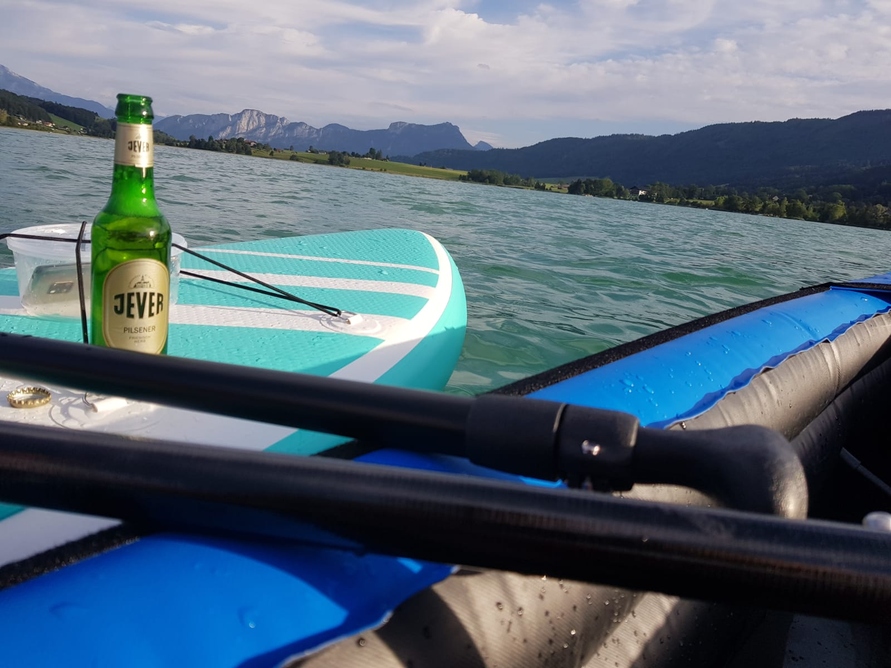
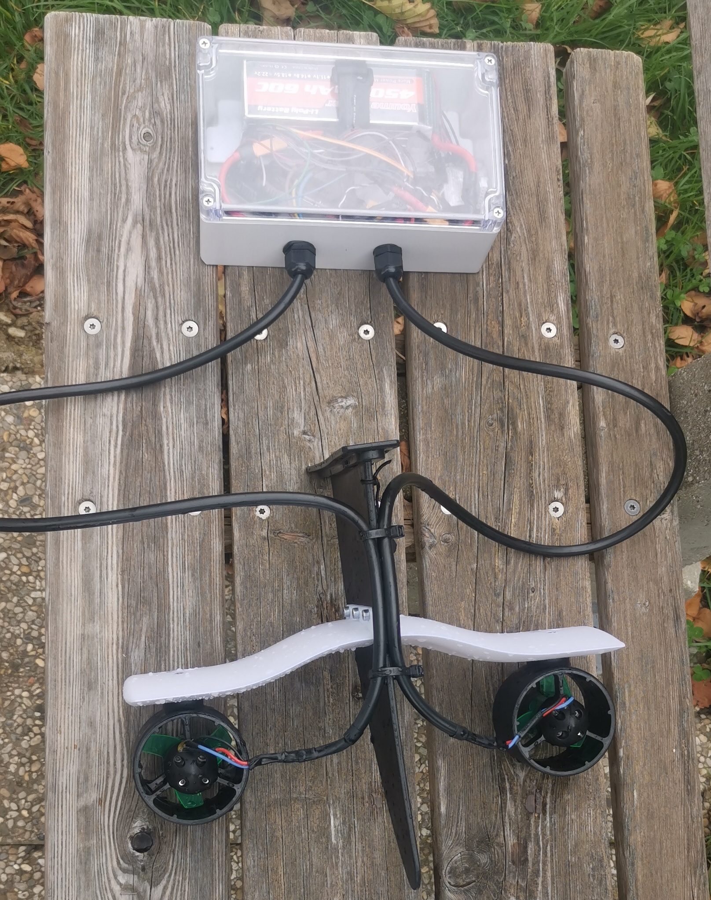
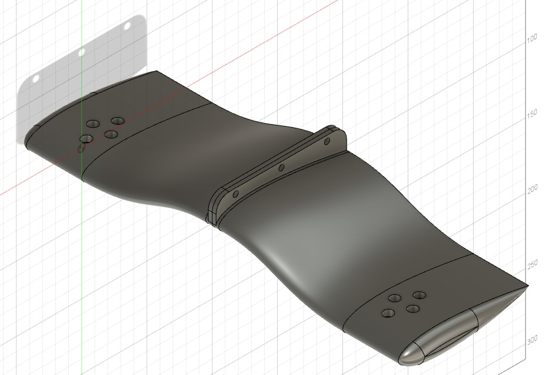
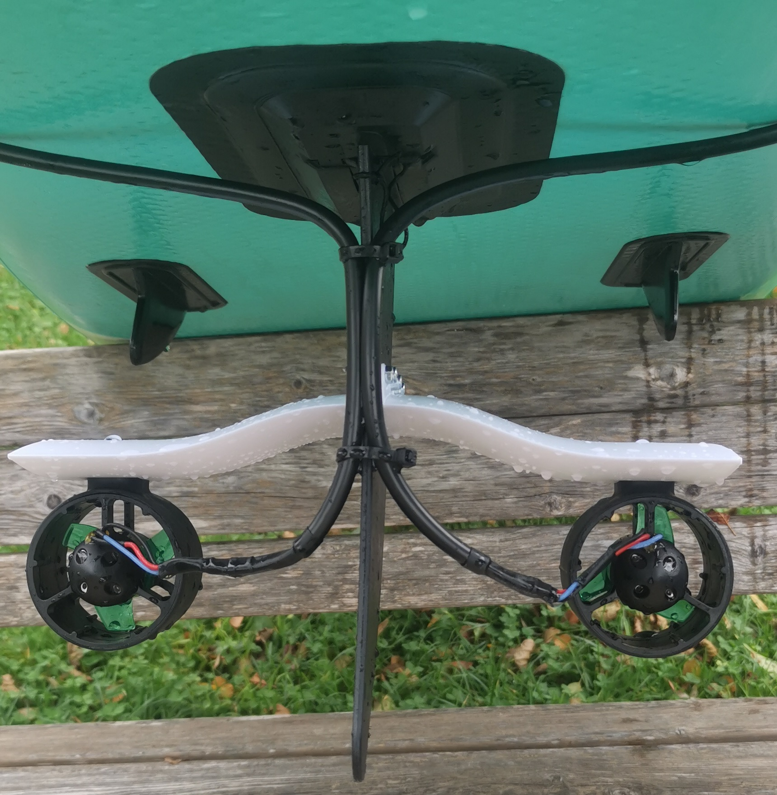
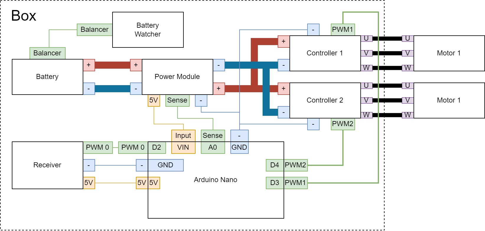
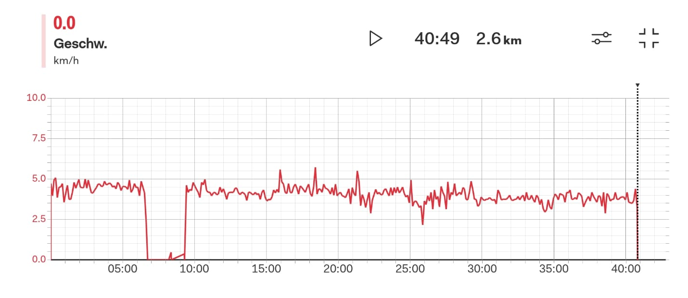
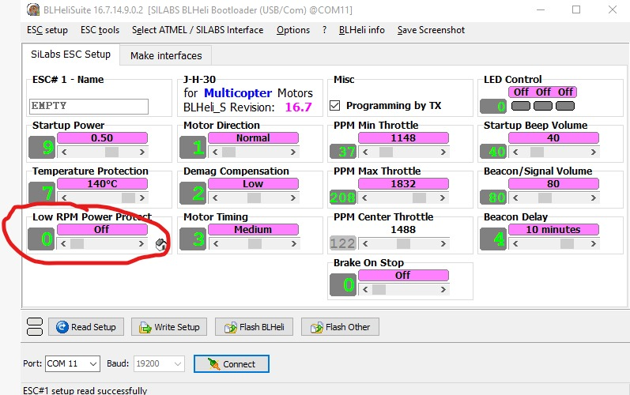

# Description about my project to drive an electric Stand Up Paddle (SUP)

## Abstract

Hi guys 👋

this is the repo to document my SUP project.
It is on the hand for me to not forget my ideas and schematics and on the other hand I hope that I can help someone by starting with her or his projects. 

Regards!

Patrick

## Disclaimer 
I only show my personal experience / project by building up an electric SUP

* I am not responsible of any damage you are producing by copying this project
* Explicitly not for any fire, which can be caused by the battery

--> Please check the regulations for your country before you are starting with your project 👍

As example in Austria 4,4kw systems (and shorter than 10m) do not need a license and you do not need a driver license (https://bootsfuehrerschein.at/)

## Overview

So enough obligatory stuff... 

I will show you the following point from my project and hints I have learned

* A couple of links I found to get a feeling about the speed or your SUP and the needed energy
* All CAD models will be stored here in the *CAD* folder (as Step and STL files) --> The modeling is done in Fusion 360 Personal so when you want access to the complete model feel free to contact me here
* All electric wiring and components I have used
* The Software I have used / written will be linked or stored in *Software* 
* A cost overview about the setups
* Links to all parts 

## Hints

### Basic fluid dynamics
First of all you cannot "calculate" the speed hard from any equation! You need to make guesses about different forces. 

In industry application there are using CFD-Simulation to define the force on a numeric model. But I guess this will be a bit of overengineering for a SUP 😂

In easy word you need this equation: 
  Fdrag = cd * A * p/2 * v^2

Fdrag (in N) is the force we produce in the fluid

cd * A (A in m^2) is the geometry part of your SUP. cd is normally known from cars as Drag-Coeffient and defines how good your geometry is laying in the fluid. And A is the area which is projected in the length of your sup. 

p (in kg/m^3) is the density of your fluid, for water it is 1

v (in m/s) is your velocity.

So in summary 
1. The drag force increases quadradic with your velocity!
2. Reducing the front area decreases the drag force --> Higher load means that the front area in the water will be increased and so also the drag force
3. Using a good shape is decreasing the drag force (That is the reason why boats are not formed like a block)

The drag in the water is not the only one. You also need to have a look on the drag your body is producing by standing on the SUP. But the density of water is a lot higher than the density of water focus first on your water components. 

Links: https://en.wikipedia.org/wiki/Drag_coefficient 

### Calculating the target speed 

So from the chapter before we learned that we cannot calculate the speed of our system by starting the project. 

But we can do "number founded guessing" 😅

Therefore one option is to go over your propeller geometry and the rotation speed of your motor. 

So in easy words: 
When your motor spins 1000 rpm (r/min --> rotation per minute) with your battery and your propeller "brings you" 10cm (cm/r --> centimeter per rotation) forward every rotation you will get the following speed: 

1000 r/min * 1 cm/r = 100 m/min = 1,7 m/s = 6,1 km/h

Ok but 3 questions
1. What means "brings you forward"? 
2. What is about the fluid dynamic from the chapter above?
3. What is about efficiency?

Ok...
1. The propeller has a pitch. So as example your propeller has pitch of 20mm it brings you 20mm forward every rotation. So here we do not go deep in the geometry of our propeller just take the pitch.
2. Because we have no idea about the fluid dynamic values we need to guess a factor for our calculation. On experience a geometry factor of 0,75 is senseful.
3. The efficiency of your motor is also really relevant when we talk about the rpm. Normally you get a KV value for your motor which means how many rpm per volt you generate. But normally your motor has a efficiency about 80% so this needs to be calculated in the rpm. 

But!

There is a calculator online so you can forget all my words from before 😁

Link: https://www.offshoreelectrics.com/conversion.php

As described with 80% motor efficiency on my motors and 25% "slip" on the propeller my calculation is fitting the reality. 

Ofcourse at the moment for slow speed (till 7km/h) --> As higher your speed will be as higher will be the fault, because your slippery will increase in quadradic way. 

## Project V1

### About

Project V1 started with a set of electronic I had at home. Therefore the focus stayed on a very easy and cheap solution. With V1 I reached **3 km/h** with a 3S battery and in V1.1 **5 km/h** with a 6S battery.

### BOM (Bill of material)

**This is explicit for the first draft of V1!**

**Before you start buying check also the subversion. So you do not need to buy this controllers when you want to build a 6S system!**

| Function | [Title](link) | Price | Bought date | Comment |
| --- | --- | --- | --- | --- |
| Battery | [Amazon Link](https://www.amazon.de/gp/product/B072KH76JN/ref=ppx_yo_dt_b_search_asin_title?ie=UTF8&psc=1) | 42€ | 28. April 2020 | - |
| Motors (2x) | [Aliexpress Link](https://de.aliexpress.com/item/1005003098852958.html?spm=a2g0o.order_list.0.0.3a0d5c5fqVCDGZ&gatewayAdapt=glo2deu) | 26€ each | 15. August 2022 | - |
| Controller (2x) | [Aliexpress Link](https://de.aliexpress.com/item/32655256635.html?spm=a2g0o.order_list.0.0.3a0d5c5fqVCDGZ&gatewayAdapt=glo2deu) | 11€ each | 12. May 2020| 40A Variant |
| Battery Watcher | [Amazon Link](https://www.amazon.de/gp/product/B07DC3LH9C/ref=ppx_yo_dt_b_search_asin_title?ie=UTF8&psc=1) | 13€ (5 pieces) | 30. April 2020 | - |
| Arduino Supply | [Aliexpress Link](https://de.aliexpress.com/item/32960292856.html?spm=a2g0o.productlist.0.0.4078186e3uUtjS&algo_pvid=5adc2301-52ea-4430-b488-4645b19b66c9&algo_exp_id=5adc2301-52ea-4430-b488-4645b19b66c9-7&pdp_ext_f=%7B%22sku_id%22%3A%2266437663811%22%7D&pdp_npi=2%40dis%21EUR%2110.56%216.34%21%21%21%21%21%40210318d116668004387873684e2977%2166437663811%21sea&curPageLogUid=qUIXzQM6Ksu5) | - | - | Bought in a set --> Link just an example |
| Remote | [Amazon Link](https://amzn.eu/d/8PQYzEu) | 25€ | 28. April 2020 | For a longboard |
| Arduino Nano | - | 3€ | - | I have no idea where all my arduinos from 😅 |
| Cables / Connectors | - | 15€ | - | Depends on your favorit cables. I did everything with XT60 |
| Wings | - | 1€ | - | Self printed |
| Waterproof Box | [Amazon Link](https://www.amazon.de/gp/product/B0B2MJH7Q5/ref=ppx_yo_dt_b_asin_title_o03_s00?ie=UTF8&psc=1) | 12€ | 28. August 2022 | - |
| Waterproof Cable holder | [Amazon Link](https://www.amazon.de/gp/product/B09J116GHX/ref=ppx_yo_dt_b_asin_title_o04_s00?ie=UTF8&psc=1) | 7€ (25 pieces) | 27. August 2022 | - |

So in sum: 192€ on my side (72€ for this project the rest stayed already in my apartment)

### Hardware / Mechanical parts

You see the mechanical design in the overview picture in attached version. The Step files are in the CAD folder. --> *CAD/V1*

The wing is based on a NACA (0018) profile without any camber. --> So "no camber" means it does not produce force in any direction

The wings are screwed with 3x M4 screws against the driving direction in the flap.

The motors are screwed with 4x M4 screws each. 

### Electric

Every side of a block in the overview represents a connector. On my side every big-line or powerline is connected with a XT60 connector. The both power cables from the controllers are soldered together in one XT60 connector to the power module. 

The connector for the motor are 4mm motor connectors. ([Amazon Link](https://www.amazon.de/gp/product/B07VYSN74H/ref=ppx_yo_dt_b_asin_title_o02_s00?ie=UTF8&psc=1))

On the power module are 3 cables soldered to the arduino. 

The interface to the receiver and to the logic input of the controllers is done with breadboard cables. 

The battery watcher is plugged directly in the balancer connector of the battery. It is just to know the cell voltage while driving and get an acoustic warning, when one cell is under the defined end voltage. 

### Software

You will find the software in the software folder. 
--> It is not pretty but it does the job 😅

The software has only 3 features 
1. Distribute the input signal to both controllers
2. Build a cruise control to not hold the receiver on throttle
3. Watch the battery complete voltage and stop the controllers if the voltage is to low 
### Project V1.1

Because the motors are rated till 6S Battery config it is near to update the system for a higher RPM on the motors!

--> With this config I reached 5 km/h with my SUP. Of course, when the voltage decreases also the speed decreases:

In general I am able to drive 45 min and 2,8 km with one 4500 mAh battery

Therefore I bought the following equipment:

| Function | [Title](link) | Price | Bought date | Comment |
| --- | --- | --- | --- | --- |
| Battery | [Amazon Link](https://www.amazon.de/gp/product/B082MGMH92/ref=ppx_yo_dt_b_asin_title_o01_s01?ie=UTF8&psc=1) | 102€ (2 Packs) | 21. October 2022 | - |
| Controller | [Amazon Link](https://www.amazon.de/gp/product/B08YK732H4/ref=ppx_yo_dt_b_asin_title_o01_s00?ie=UTF8&psc=1) | 43€ (4 pieces) | 21. October 2022 | - |
| XT60 Connector | [Amazon Link](https://www.amazon.de/gp/product/B074RGT76J/ref=ppx_yo_dt_b_asin_title_o00_s01?ie=UTF8&psc=1) | 6€ (5 pairs) | 21. October 2022 | - |

So in sum 151€ extra costs

---
The mechanical and electric parts stayed the same. 

#### Controller

The interface from the controller differ from the original one. Therefore the software changed from PWM to DShot. You will find the software in the corresponding subfolder. 

The controller itself is a bit underpowered for my motor so I changed the configuration via the BLHeli interface. 

**I will show you a konfig setting I needed to change to power up my motor by I also burned one of the 4 controller with the setting and a other motor (a high RPM drone motor to test). So be really careful!**

The config I changed: 

To change it I connected the controller via an Arduino Uno. 
1. Connect the input pin from your controller **with pin 0 from the Arduino**
2. Use the BLHeliSuite 16.7.x
3. Flash the arduino to "Arduino BLHeli Bootloader"
4. Connect to the controller with the interface "**SILABS** BLHeli Bootloader (USB/COM)"

## Project V2

So the forecast will be true 😁

### Battery

I will build up an own battery and use the LG INR21700 M50T Cells: [Datasheet Link](https://drive.google.com/file/d/1JHFoAIexketoOInWRFahl89vgbPXum7t/view)

In the configuration of 12S6P are 72 Cells so 1,3 kWh Capacity in theory. The cells can give continuously 3C so 15A in the configuration with 6P the Battery is usable till 90A. With 43V (12S * 3,6V) the Battery can be used till 3.9kW continuously. 

| Function |Link | Price | Bought date | Comment |
| --- | --- | --- | --- | --- |
| Cells | [Nkon Link](https://www.nkon.nl/de/lg-m50lt.html) | 300€ (75 Cells) | 13. January 2023 | - |
| 2x Spacer | [Nkon Link](https://www.nkon.nl/de/2x21700-battery-spacer-holder.html) | 33€ (74 pieces) | 13. January 2023 | - |
| Battery Soldering Strip | [Nkon Link](https://www.nkon.nl/de/nikkel-battijersoldeerstrip-10mm-20mm.html) | 22€ (8m) | 13. January 2023 | - |
| BMS | [Ebay Link](https://www.ebay.de/itm/124866339442) | 95€ | 13. January 2023 | - |
| Charger| [AliExpress Link](https://de.aliexpress.com/item/1005003942168351.html?spm=a2g0o.order_list.order_list_main.5.21ef5c5fsMSNtn&gatewayAdapt=glo2deu) | 50€ | 14. January 2023 | 400W without balancing |
| Connectors | [AliExpress Link](https://de.aliexpress.com/item/4001269695540.html?spm=a2g0o.order_list.order_list_main.5.21ef5c5f35rnWi&gatewayAdapt=glo2deu) | 27€ (5 pieces)| 14. January 2023 | Waterproof 4 Pin á 25A |

So in Sum 527€

### Powertrain

| Function |Link | Price | Bought date | Comment |
| --- | --- | --- | --- | --- |
| Motor + Propeller | [Flipsky Link](https://flipsky.net/collections/waterproof-motor/products/flipsky-inrunner-brushless-dc-65111-motor-160kv-3000w-for-surfing-boat-underwater-thruster-for-hydro-efoil) | 171$ | 30. October 2022 | - |
| Controller | [Flipsky Link](https://flipsky.net/collections/electronic-products/products/mini-fsesc4-20-50a-base-on-vesc-widely-used-in-eskateboard-escooter-ebike) | 90$ | 30. October 2022 | - |
| Bluetooth-Adapter | [Flipsky Link](https://flipsky.net/products/core51822-ble4-0-bluetooth-2-4g-wireless-module-nrf51822-onboard-ws82013?variant=8703117819964) | 26$ | 30. October 2022 | This is optional but makes the config easier |

So in Sum with shipping 344$ or 361€

## Forecast

Because 5 km/h is still to slow I will exaggerate a bit 😁

The following motor is in delivery: https://flipsky.net/products/flipsky-inrunner-brushless-dc-65111-motor-160kv-3000w-for-surfing-boat-underwater-thruster-for-hydro-efoil?variant=37571726344379 

It will spin 8k rpm with a 12S battery (so 2x 6S in series) and generates up to 3 kW 🎉

With the guessing from before I expect a velocity around 40 km/h but I will update this sheet when I set up everything. 